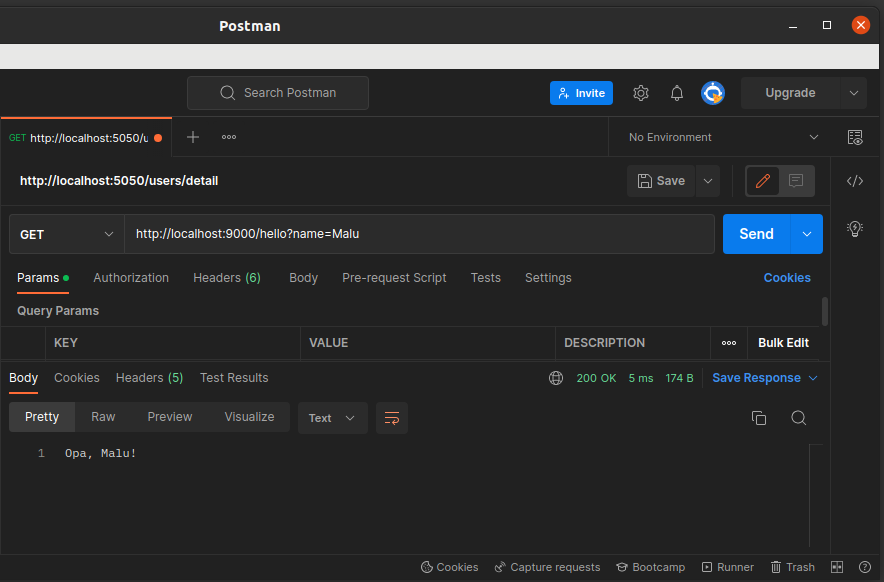

# iniciando_spring_boot
Augusto iniciando uma aplicação inicial **Spring Boot**. Tipo "Hello World", simples.

Ao clonar o projeto, facilmente você pode importar na sua IDE. No meu caso, utilizo o Eclipse STS 4.
O projeto foi escrito em Java 11, versão do Spring Boot 2.7.8, conforme `iniciandoapi/pom.xml`.

1. ## Executando o App:
Além de poder executar a aplicação pela sua IDE, no diretório do código você também pode exectutá-lo via comando das seguintes formas:
```bash
# .. estilosamente via maven
mvn spring-boot:run
# .. ou
java -jar iniciandoapi-0.0.1.jar
```
Há outras formas de executar também. Lembrando que esse segundo comando é necessário gerar o JAR executável (no meu caso gerei através do Eclipse).

2. ## Testando a aplicação:
Pode ser no próprio browser `http://localhost:9000/hello`.
Ou, via Postman:


3. ## Subindo com Docker:
```bash
# 1. Gerando Imagem Docker:
docker build -t iniciandoapi .

# 2. Executando container em docker:
docker run --add-host=host.docker.internal:172.17.0.1 --name iniciandoapi -p 9000:9000 -d iniciandoapi 
```
Aqui também é necessário gerar o JAR.

4. ## Referencias:
[Spring Quickstart Guide](https://spring.io/quickstart)

